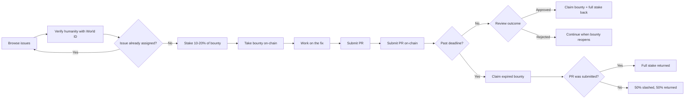
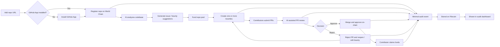

# mergeX

**Backend Repo [https://github.com/anushkasomani/mergeX-backend](https://github.com/anushkasomani/mergeX-backend)**

**Contract Address (World Chain Sepolia):** `[0x4709817e9BBEFB887c7DDd443d39A3BaAA433348](https://sepolia.worldscan.org/address/0x4709817e9BBEFB887c7DDd443d39A3BaAA433348)`

mergeX is a decentralized open-source bounty coordination platform. It helps organizations create, assign, review, and settle issue bounties with on-chain incentives, verified human contributors, AI-assisted workflows, and tamper-evident audit logs.

Instead of asking contributors to trust maintainers, centralized payout systems, or black-box review flows, mergeX moves the important parts of the workflow into a more transparent and auditable system.

## The Problem

Open-source contribution platforms still have a few major trust problems:

- Maintainers can learn from a contributor's work, copy the approach, and merge or reproduce the fix without fairly rewarding the contributor.
- Experienced contributors can dominate visibility and issue allocation, making it harder for new contributors to break in.
- Bots and fake identities can get assigned to issues, which creates spam, low-quality submissions, and room for Sybil attacks.
- Most bounty payment systems are still centralized, so contributors depend on an off-chain promise instead of trustless settlement.
- AI is increasingly being used to create issues and review pull requests, but most platforms give no reliable audit trail for how those decisions were made.

## What We Built

- A World Chain-based bounty system where repositories are registered on-chain and reward pools are managed transparently.
- Two-sided staking where repo owners fund the repository pool and contributors stake 10-20% of the bounty to take an issue.
- World ID-based human verification to reduce bots, duplicate identities, and Sybil-style issue farming.
- An internal AI workflow that helps organizers analyze a codebase, surface issues, and turn them into bounty candidates.
- AI-assisted PR analysis that helps organizations review submitted fixes before approving or rejecting them.
- A GitHub-connected workflow for importing repos, open issues, PRs, and syncing bounty activity with real repository work.
- Expiry and slashing logic that makes the flow fairer: abandoned work can be penalized, while unreviewed submitted work can recover stake without slashing.
- A repo-linked audit system where important app actions create a minimal audit event that is stored on Filecoin.
- An audit page where registered repo owners can inspect Filecoin-backed logs mapped to their repositories.

## Workflow Overview

mergeX has two connected workflows: one for contributors and one for organizations. The contributor flow focuses on claiming work, staking, submitting PRs, and settlement. The organization flow focuses on repo onboarding, AI-assisted issue creation, bounty management, review, and auditability.

## Contributor Workflow

Contributor-side flow:

- Contributors browse open issues, verify with World ID, and take work only if the issue is still free.
- Taking a bounty requires a 10-20% stake, which helps reduce spam claims and low-commitment participation.
- If the work is approved, contributors claim the bounty and recover stake. If the PR is rejected, the bounty reopens. If the deadline expires, stake treatment depends on whether a PR was submitted.

## Organization Workflow

Organization-side flow:

- Organizations onboard a repo, install the GitHub App if needed, and register the repo on World Chain.
- The internal AI helps analyze the codebase and turn findings into issue and bounty candidates.
- After contributors submit PRs, organizations use AI-assisted review and then approve, reject, reopen, fund, or manage bounties while leaving an auditable trail.

## Why The Audit Trail Matters

Every meaningful action in the app can leave a minimal audit trail. That includes actions like taking a bounty, submitting a PR, approving a merge, rejecting a PR, funding a repo, withdrawing funds, or resolving an expired bounty.

Those events are stored on Filecoin so they are not just hidden inside an internal database. The logs are mapped back to the repository, which makes the history auditable from the repo's audit page and makes platform behavior more transparent for the repo owner.

This does not ask users to blindly trust an AI verdict or a platform admin. It creates a persistent trail that can be inspected later.

## Core Flow

### For Organizations

- Add a repository and register it on World Chain.
- Use AI assistance to inspect the codebase and identify bounty-worthy issues.
- Fund the repo pool and create one or many bounties from GitHub issues.
- Review submitted PRs with AI support.
- Approve merged work, reject low-quality work, or manage repo funds directly on-chain.

### For Contributors

- Browse available bounties.
- Verify humanity with World ID.
- Take a bounty by staking 10-20% of the bounty amount.
- Submit a PR linked to the issue.
- Claim the bounty after approval, or recover stake according to the expiry rules.

## Stack

- **World Chain:** smart contract deployment, bounty escrow, repo registration, and payout flow
- **World ID:** proof of personhood for contributor verification
- **Filecoin:** storage for audit logs and audit report artifacts
- **AI Agent Layer:** codebase analysis, issue generation support, and PR review assistance
- **GitHub App + API integrations:** repo onboarding, issue import, PR review, and merge workflow

More detail on how World Chain, World ID, Filecoin, and the AI layer are used is in [INTEGRATIONS.md](./INTEGRATIONS.md).

## Roadmap

- Move from current testnet deployment to a stronger production deployment path on World Chain.
- Make AI-generated issue creation more structured with clearer severity, bounty sizing, and confidence signals.
- Expand contributor reputation using auditable on-chain and Filecoin-backed activity history.
- Add stronger anti-collusion and anti-griefing protections around assignment, review, and payout disputes.
- Improve AI verifiability by making review artifacts, prompts, and decision traces easier to inspect and compare.
- Add richer organization tooling for bounty analytics, contributor funnels, and repo health insights.
- Support deeper automation around issue triage, duplicate detection, and PR quality checks.

## Repo Layout

- [PL](./PL): frontend app
- [backend](./backend): API, GitHub integration, AI analysis, and audit routes
- [backend/contracts](./backend/contracts): World Chain smart contract and deployment scripts

